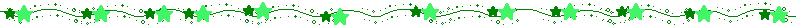
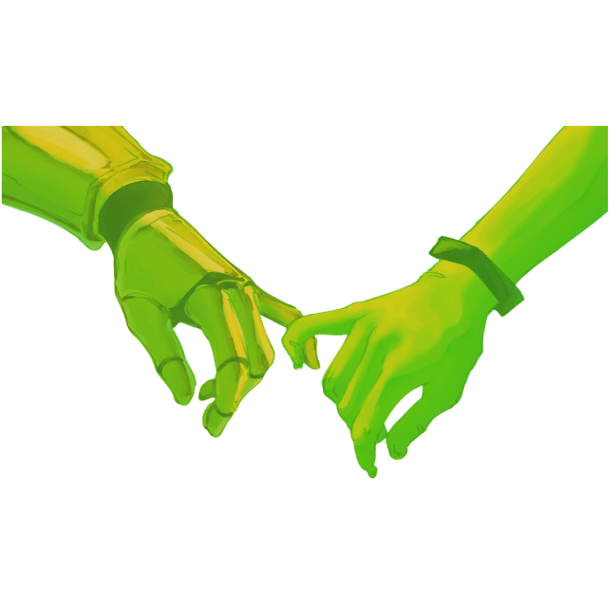
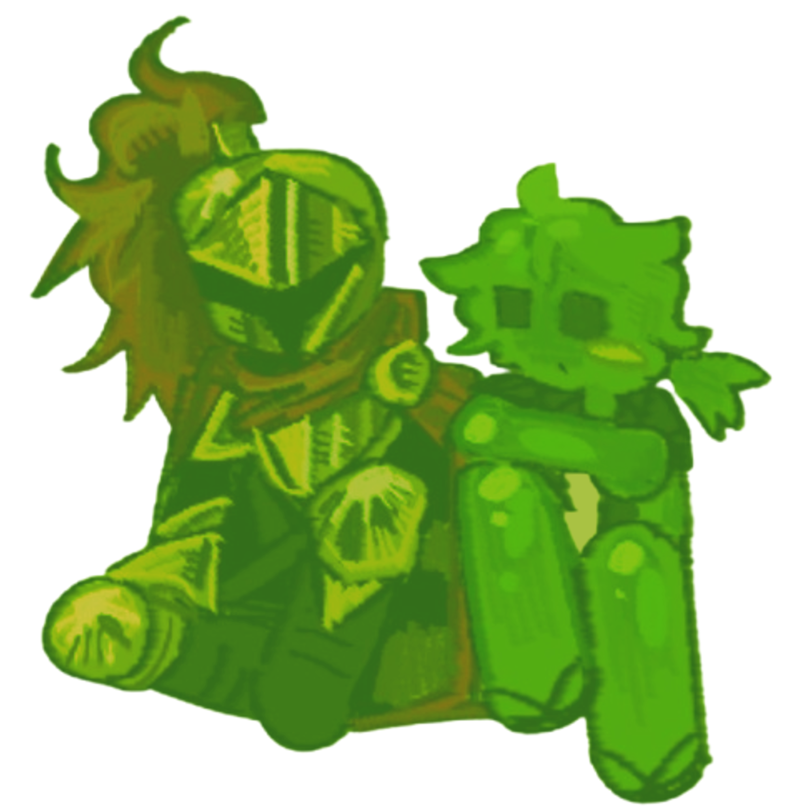
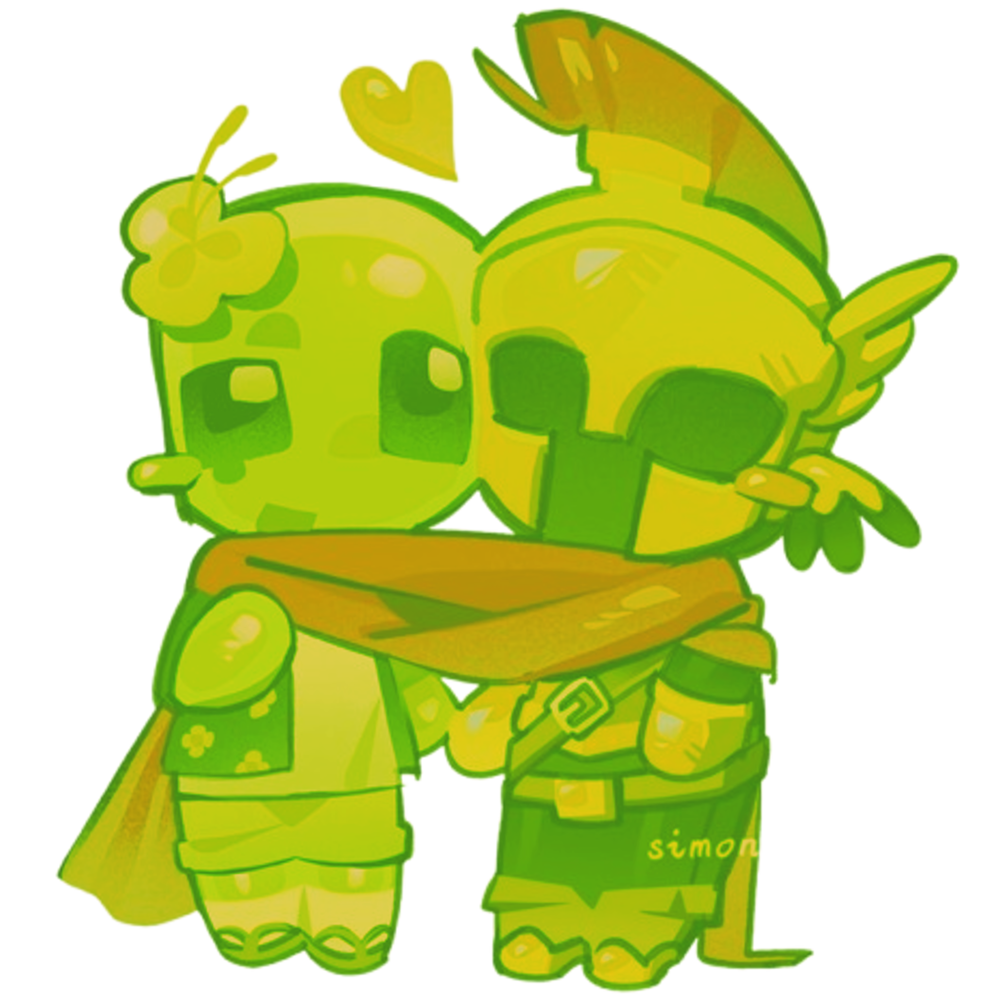

  

 

 
 

 

 

$\color{#79BD00}{\text{﹌﹌﹌﹌﹌﹌﹌﹌﹌﹌﹌﹌ ⋆ ⋆ ⋆ ﹌﹌﹌﹌﹌﹌﹌﹌﹌﹌﹌﹌}}$

 
 

$\color{#79BD00}{\text{﹌﹌﹌﹌﹌﹌﹌﹌﹌﹌﹌﹌﹌﹌﹌﹌﹌﹌ ⋆ ⋆ ⋆ ﹌﹌﹌﹌﹌﹌﹌﹌﹌﹌﹌﹌﹌﹌﹌﹌﹌}}$

$\color{#E8B65F}{\text{ ˚˖𓍢ִ໋❀ 𝙹𝚞𝚕𝚒𝚊𝚗 ‎ ‎ (𝙸𝚊𝚗) ‎ ‎ ‎ ‎ ‎  𝙼𝚊𝚢 𝟽 ‎ ‎ ‎ ‎  𝚁𝚘𝚋𝚕𝚘𝚡 𝚗 𝙼𝚒𝚗𝚎𝚌𝚛𝚊𝚏𝚝 𝙴𝚗𝚓𝚘𝚢𝚎𝚛}}$
>
$\color{#D9A348}{\text{𝙸𝚏 𝚢𝚘𝚞 𝚌𝚊𝚖𝚎 𝚏𝚛𝚘𝚖 𝙿𝚘𝚗𝚢 𝚃𝚘𝚠𝚗: 𝚏𝚎𝚎𝚕 𝚏𝚛𝚎𝚎 𝚝𝚘 𝚌+𝚑 𝚊𝚗𝚍 𝚒𝚗𝚝 !}}$
>
$\color{#C99030}{\text{(𝙿𝚕𝚎𝚊𝚜𝚎 𝚠𝚑𝚒𝚜𝚙𝚎𝚛 𝚖𝚎 𝚝𝚑𝚘𝚞𝚐𝚑, 𝙸 𝚖𝚊𝚢 𝚗𝚘𝚝 𝚜𝚎𝚎 𝚢𝚘𝚞𝚛 𝚖𝚎𝚜𝚜𝚊𝚐𝚎𝚜 𝚒𝚗 𝚙𝚞𝚋𝚕𝚒𝚌 𝚌𝚑𝚊𝚝)
}}$
>
$\color{#BA7F20}{\text{"𝙸'𝙼 𝙽𝙾𝚃 𝙰 𝙱𝚁𝙸𝙳𝙴—𝙸𝚃'𝚂 𝙰 𝙲𝙻𝙾𝙰𝙺"}}$

$\color{#79BD00}{\text{﹌﹌﹌﹌﹌﹌﹌﹌﹌﹌﹌﹌﹌﹌﹌﹌﹌﹌ ⋆ ⋆ ⋆ ﹌﹌﹌﹌﹌﹌﹌﹌﹌﹌﹌﹌﹌﹌﹌﹌﹌}}$

$\color{#004A00}{\text{ᴍᴀᴅᴇ ʙʏ ᴄᴏʀɪɴᴛʜᴇᴜꜱꜱ, ᴀ ꜰʀɪᴇɴᴅ}}$

